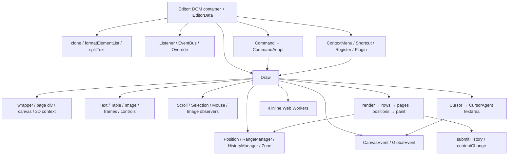
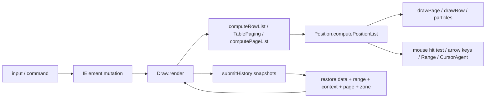
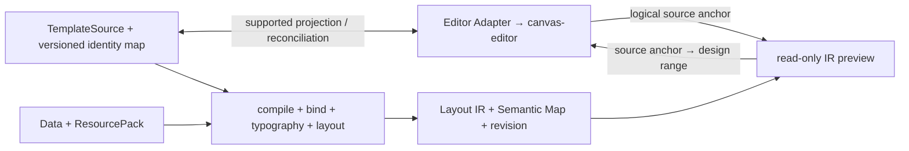

# ADR-0002 草案：canvas-editor 隔离与 Editor Adapter 接法

**状态：** Proposed（issue 07 静态调研完成；issue 35 最小运行时验证后，由 issue 19 / WP0.10 冻结）
**日期：** 2026-09-12
**关联：** [issue 07](../../.scratch/first-release/issues/07-canvas-editor-isolation-spike.md)、[首版 spec](../../.scratch/first-release/spec.md)、[ADR-0001](ADR-0001-technology-baseline.md)、[issue 22](../../.scratch/first-release/issues/22-designer-shell-and-editor-adapter.md)

## 建议与证据边界

首版建议采用 **(a)：自有模型投影到 canvas-editor 做设计态编辑，独立预览消费自研 Layout IR**。先以未修改的 1.0.2 验证显式支持清单；暂不 fork。命令、选区和插件可以封装复用，但没有公开的 Layout / Renderer 注入协议。**(b)：保留命令与选区壳、绘制完全由 IR 驱动**，需要改造布局、几何命中、输入法锚点和历史恢复，属于交互内核级 fork，不能按“替换一个绘制函数”估算。

这是固定源码与发布包的静态 spike，不是可运行 Editor Adapter，也不构成中文输入法、跨页选区或 round-trip 验收。本文的建议、风险评级和拟议接口均为工程推断；核查记录见[基线证据](evidence/canvas-editor-1.0.2-isolation.json)。issue 22 仍依赖 issue 20 的契约冻结。审核后的函数级隔离复验与逐项处置见[审核处理记录](../../.scratch/first-release/issue-07-review.md)，不提升为真实浏览器验收。

与 ADR-0001 的确定性约束一致：canvas-editor 只进入浏览器编辑边界，Layout / Typography Core 与服务端导出继续使用同一份自研内核。与 spec §模块表中“统一内核注入”的关系需在 WP0.10 明确：方案 (a) 将统一内核用于预览及最终输出，设计态仍运行上游布局，**不承诺设计页的分页、断行或光标坐标与 IR 相同**。若产品要求直接在最终 IR 版面中编辑，(a) 不满足该要求，应重新评估 (b) 或替代编辑壳。本草案不修改已接受的 spec。

## 1. 固定基线与核查方法

| 项目 | 2026-09-12 实际核查 |
| --- | --- |
| npm 包 | `@hufe921/canvas-editor@1.0.2`；下载并解包，不安装到 workspace |
| registry `gitHead` | `83985f729cde373eccdcf25314227827b971bb63` |
| npm tarball SHA-256 | `7b17b062f915f31ccae6fa202088fd5443583da2e85e6a017f81a6cde7da4c21` |
| registry SRI | `sha512-uAdI70JPqakd9+8TmSO1Fv77xDG86vCXaAVfqwMChJnAiz9Ub77l2ep0t8/lnydoIjdFqywcs+dea7x2f9vNEg==`；复算相等 |
| 固定提交源码归档 SHA-256 | `6e9a875b15885e88ed1e710468f75d8a4d5ad44de74faeacef5298e5cf77f2bd` |
| 许可 | 发布包含 MIT LICENSE；本票未引入运行时依赖 |
| 接口交叉核查 | 源码 `Command.ts` 的 157 个代理成员均存在于发布包 `Command.d.ts`；另有 `setInterceptor` 方法 |
| 发布物交叉核查 | ESM bundle 中确认四个 Worker、Draw 初始化、组合输入、`setValue` 清历史、命令 interceptor 路径 |

源码来自 registry 指向的固定提交，来源链接均固定 SHA。发布包 `package.json` 没有 `dependencies`，源码仓库 manifest 则有 cspell / prismjs 等依赖，不能把仓库开发/应用依赖树当成安装依赖树，也不能把“零 npm dependencies”解释为不依赖浏览器。未构建上游或证明产物与源码逐字节可重现。发布物 sourcemap 有 200 个来源名，仅 3 个非空 `sourcesContent`，不能用它证明所有 TS 源码相同。

复查入口：[registry 元数据](https://registry.npmjs.org/@hufe921/canvas-editor/1.0.2)、[npm tarball](https://registry.npmjs.org/@hufe921/canvas-editor/-/canvas-editor-1.0.2.tgz)、[源码归档](https://codeload.github.com/Hufe921/canvas-editor/tar.gz/83985f729cde373eccdcf25314227827b971bb63)。本地缓存位于 `.scratch/first-release/reference/`（忽略入库），JSON 证据保存关键源码/声明/发布文件摘要、完整命令与事件名称，可在解包后用 `shasum -a 256` 复核。不依赖 `main` 或移动标签。

## 2. 初始化与运行依赖图

`Editor` 构造器直接 `new Draw`，之后把 Draw 绑定到 CommandAdapt、菜单和快捷键；Draw 没有作为公开实例字段返回，构造参数也没有工厂替换项。[S1]

| 子链 | 实际依赖与触发时机 | 隔离判断 / 源码 |
| --- | --- | --- |
| 数据规范化 | 构造期 clone，三域 header/main/footer 执行 `formatElementList`；补偿段首元素、拆分文字；`splitText` 使用 `Intl.Segmenter` 并有 fallback | 仅限编辑层；分段结果不能输入确定性布局契约。[S1][S10] |
| 容器与纸张 | Draw 构造中创建 wrapper/page div/canvas，`getContext('2d')`；页面尺寸、scale、DPR 影响画布 | 初始化本身就需要真实 DOM 与 Canvas。[S2] |
| 光标与代理输入 | `Cursor` 创建可视光标，`CursorAgent` 创建 textarea 并注册键盘、input、paste、compositionstart/end；焦点、候选框位置取自 Position | UI 功能；不能把 textarea 定位与私有几何分开处理。[S3][S4] |
| 页面事件 | CanvasEvent 在 pageContainer 注册 click/mousedown/up/leave/move/dblclick/dragover/drop；处理器直接调用 Draw、Position、Range | 仅替换公开 Command 不会接管所有输入路径。[S5] |
| 全局事件 | GlobalEvent 注册 window blur、document mouse/wheel/visibilitychange；`matchMedia` 监听 DPR | 多实例与卸载须验证全局监听释放，缩放影响命中。[S5] |
| ScrollObserver | document 或指定滚动容器的 scroll 事件，读取窗口/视口/滚动位置 | 命名为 Observer，但不是原生 Mutation/ResizeObserver。[S6] |
| SelectionObserver | 容器鼠标监听、document mouseleave、`requestAnimationFrame` 自动滚动 | 拖选越过视口与跨页依赖此链及页面几何。[S6] |
| MouseObserver | pageContainer 上鼠标事件转发 EventBus | 元素移除后需检查实例不被外部订阅保留。[S6] |
| ImageObserver | Promise 队列，`allSettled` 等待图片；不是浏览器 observer API | 初始化仅建队列；图片内容另触发 `Image` 加载。[S6] |
| 懒绘制 | 分页模式 render 创建原生 `IntersectionObserver` 观察各页，进入视口后 `_drawPage` | 预览独立管理自身页生命周期，不借用此可见页列表。[S2] |
| 四个 Worker | WorkerManager 构造即启动 wordCount/catalog/group/value，Vite `?worker&inline`；消息用元素/位置快照 | 并非 Layout Worker；只做辅助计算/值导出。bundle 用 Blob URL 并有 data URL fallback，需验证部署 CSP。[S7] |
| 图元与附属 UI | TextParticle Canvas 度量/绘字；Image/LaTex/背景/水印等可创建 Image；表格工具、弹窗、标尺、ARIA 辅助 DOM | 内容按需启用，禁用某功能不等于移除 Draw 的浏览器依赖。[S2][S9] |
| 菜单、快捷键、Actuator | ContextMenu/Shortcut 捕获 Draw；Actuator 订阅 positionContextChange 更新交互状态 | 插件不是独立命令总线；禁止清空所有 EventBus 订阅来管理自有订阅。[S1][S8] |
| 销毁 | Editor.destroy → Draw.destroy、Shortcut/ContextMenu.removeEvent、清 EventBus；Draw 终止四个 Worker，释放全局/滚动/选区监听与懒绘制 observer | 源码有释放路径；真实多实例/挂载卸载泄漏尚未实测。[S1][S2] |

扫描 `src/editor` 未发现 `ResizeObserver` 或 `MutationObserver` 的引用；原生观察器入口是 IntersectionObserver。剪贴板还会按操作调用 `navigator.clipboard`，图片/iframe 内容可能访问 URL，属于宿主资源与粘贴策略范围，不能让其进入服务端渲染依赖。

## 3. 可复用接口与不能承诺的边界

以下“复用”只表示 API 存在且适合在 Adapter 内调用，尚未通过平台支持清单验收。完整名称在[证据 JSON](evidence/canvas-editor-1.0.2-isolation.json) 的 `commandMembers` / `eventNames`；参数类型以固定发布包声明为准。[S8]

| 类别 | 接口例子 | Adapter 策略 |
| --- | --- | --- |
| 生命周期、模式 | `new Editor`、`destroy`、`executeMode`、`executeFocus/Blur/HideCursor` | 仅 designer 使用；模式切换必须做内容前后对照，PRINT 模式会过滤控件辅助元素，不能视为纯视觉开关 |
| 文本与样式 | `executeInsertElementList`、`executeBackspace`、`executeFont/Size/Bold/Italic/Underline/Strikeout/Superscript/Subscript/Color/Highlight` | 显式支持清单内封装；字体 identity 与字号单位按自有模型映射，不能保存任意系统字体名作为最终字体身份 |
| 段落与结构 | `executeTitle/List/RowFlex/RowMargin`、`executeHyperlink`、表格与媒体命令族 | issue 22 先段落/标题/列表/样式；表格和媒体分别留给后续票，未支持节点不得扁平化丢失 |
| 编辑操作 | `executeUndo/Redo/Painter/ApplyPainterStyle/Format`、`executeSearch/Replace/SearchNavigatePre/SearchNavigateNext` | 可操作投影；每项还要验证回到自有模型后的身份和语义 |
| 读写 | `getValue`、`getValueAsync`、`executeSetValue`、`getText`、`getElementById`、`executeUpdateElementById` | 持久化必须经过反向转换；`getValue` 做 zip/属性筛选，不是原始元素完整转储；异步读取须串行化或先验证并发行为 |
| 选区 | `getRange/RangeText/RangeContext/RangeRow/RangeParagraph`、`executeSetRange/ReplaceRange/SetPositionContext/SetZone` | 范围与区域先映射为自有逻辑 anchor，再驱动预览；表格必须恢复 position context，不能只赋索引 |
| 设计几何 | `getCursorPosition`、`getRangeContext().rangeRects`、`getPositionContextByEvent`、`getGroupRectList` | 只在设计画布有效；不可标为 Layout IR、Semantic Map 或最终页坐标 |
| 输出相关 | `getImage`、`getHTML`、`executePrint`、`executeComputeElementListHeight` | 绕开平台导出、摘要和分页链；图片快照/HTML 不能充当自研矢量输出 |
| 通知 | `listener.contentChange/rangeStyleChange/...`；`eventBus.on/off` 的 contentChange、rangeChange、renderChange、input、positionContextChange、page/zone/control/image 事件 | EventBus 多订阅适合 Adapter；保存自身 callback 并 off；Listener 为单回调槽。contentChange 无操作补丁，renderChange 也不是排版替换回调 |
| 扩展 | `use(plugin, options)`、`register.contextMenuList/shortcutList/langMap`、`override.paste/pasteImage/copy/drop` | 插件函数只拿到 Editor。剪贴板 override 可 `preventDefault`；没有自定义元素 renderer、shaper 或 layout provider 注册槽 |
| 命令观察 | `command.setInterceptor` | 返回值为 void，wrapper 总会继续执行原命令；不是取消/替换协议。CanvasEvent 的直接输入也不经过所有公开命令 |

### 选区与身份模型

`IRange` 以当前元素序列的 startIndex/endIndex 表示范围；折叠时二者相等，普通文本替换针对 `(startIndex, endIndex]`。段落 ZERO 补偿元素、`getSelection` 的段首特殊处理和表格分支使它不能直接等同 DOM Range 或 UTF-16 偏移。跨单元格还带 tableId、tr/td 起止索引；`IPositionContext` 带嵌套 tablePath。`RangeContext` 提供页/行/列与矩形信息，但源于私有 Position。[S11]

建议 Adapter 维护逻辑 anchor：文档 revision、nodeId、文本偏移及边界方向；偏移单位由 issue 20 与 IR/source-map 契约统一。投影中一个源节点可拆成多个字素元素，同一字符区间可对应多个 IR glyph。必须显式转换编辑器字素索引、源文本偏移、HarfBuzz cluster 及重复展开实例标识，不按元素下标或 pageNo 做恒等映射。

`IElement` 有 id、externalId、extension、conceptId，不能因此推断稳定身份已解决：zip 默认名单保留 extension/externalId/conceptId，却不含 id；getValue 的 extraPickAttrs 可以补选 id，但输入复制属性列表不自动复制 extension/externalId。`formatElementList`、拆并文本、粘贴和重复节点均会改变投影。建议保留源 AST 与版本化映射表，用 extension/externalId 作为候选关联提示，新增/拆分/合并/复制都需分配或修复映射；不能把业务 bindingId 塞进 conceptId，更不能把完整 AST 复制进每个字素。[S10]

当前仓库 Document Model 仍为 v0，样式尚未覆盖全部标题/列表/链接/上下标需求，Layout Core 仍是占位。因此本票没有通过虚构 v1/IR 结构声称 round-trip 或 IR 编辑已实现。issue 20/22 应共同冻结映射与 unsupported 节点的保留策略。

## 4. 私有布局与绘制的耦合证据

- **度量和绘制没有共同可替换抽象。** TextParticle 使用 `ctx.measureText` 与 `fillText`；即使提供 element.width，其他字体包围盒度量仍走 Canvas。`RenderMode.COMPATIBILITY` 是文字绘制策略，不能注入已定位 glyph。[S9]
- **分页与命中共享缓存。** Draw.render 顺序计算行、跨页表格片段、页和 Position，再绘制并恢复光标；`isCompute:false` 复用既有私有数据，没有输入外部 IR 的参数。Position 消费这些行与元素，鼠标/键盘读取其结果。[S2][S11]
- **绘制也包含交互层。** drawRow 中绘制选区；_drawPage 还绘制页眉页脚、搜索/控件高亮和表格装饰。替换 _drawPage 会丢失这些行为，而仅覆盖 Canvas 像素会留下与可见文本不符的命中几何。[S2]
- **历史是状态闭包。** submitHistory 保存正文/页眉/页脚元素、range、positionContext、pageNo、zone，undo/redo 回放后再次 render；不是面向自有 AST 的事务日志。[S12]

部分内部类方法标为 TypeScript public，但类实例被封在 Editor 构造链内，参数仍依赖私有模型。深层 import、`as any` 获取成员或 monkey patch 都应计入 fork/私有依赖维护成本；不能当成稳定插件扩展点。

## 5. 两条接法与 fork 范围

### (a) 设计投影 + 独立 IR 预览（建议）

编辑器管设计态交互，自有源文件是持久化与编译依据。用户一次已提交编辑经 Adapter 协调回源模型，递增 revision 后启动预览；只接受与当前源 revision、数据和资源身份匹配的完成结果，丢弃旧任务返回。预览消费已定位图元/字形，不用 Canvas 字符串重排；待 IR 绘制能力实现后才验证这一链。

不在每次 contentChange 后调用 executeSetValue：它会清历史并重新规范化内容。`contentChange` 在 `nextTick` 中触发，而该版本 nextTick 是 `setTimeout(..., 0)`；同一轮命令 A/B 各自建立历史后，两次通知读取的都可能是 B。通知没有历史条目 ID，不能用事件次数、文本 hash 或“保留足够版本”关联源历史。[S2][S12][S13]

#### 待验证的单一历史关联协议

以下是 issue 35 验证的候选机制，尚非上游能力或 v1 冻结接口。以**同步历史检查点钩子 + Adapter 源事务协调器**作为明确可实现的候选；外部协调若能证明同等不变量，可免除钩子补丁，否则应计入必要 fork，不能继续宣称零 fork。

| 阶段 | 关联与恢复规则 |
| --- | --- |
| 开始事务 | 在修改前分配 transactionId，保存不可变 before 源 AST、身份映射、完整编辑投影及逻辑选区/zone/table context。覆盖直接输入、粘贴、拖拽、快捷键和领域命令，不能只包公开 Command。compositionstart 属于事务开始，临时 input 不另建已提交事务。 |
| 建立历史检查点 | 上游每个已接受检查点获得唯一 historyEntryId；钩子在修改完成且下一次修改尚未开始前，同步关联 after 源 AST、身份映射、投影和选区。若归一化或反向转换失败，恢复 before 并不发布该条目。初始文档也有基线条目。不能等异步 contentChange 才取快照。 |
| 关联保存 | 上游恢复闭包捕获 historyEntryId；Adapter 用文档 sessionId + historyEntryId 查到唯一源快照，而不是按上游栈位置或可见文本查找。条目被裁剪、清栈、重载或分支丢弃时同步释放关联；缺失关联即阻止继续编辑/保存并诊断，不猜测。 |
| 普通提交 | 同步提交源快照、映射和上游检查点后，发布新的单调递增 documentRevision 并调度预览。contentChange 仅作失效/一致性通知，不能再次生成源事务。连续 A/B 即使通知合并，也保留独立 A/B 检查点。 |
| undo / redo | 上游恢复入口携带目标 historyEntryId 与动作类型；协调器在抑制用户输入和派生通知期间恢复匹配源 AST、映射、编辑投影及逻辑选区，校验后一并公开。失败回到动作前的完整状态；回放不新增普通历史条目。documentRevision 仍递增，不能退回历史数值，否则旧预览可能被误接受。 |
| undo 后新编辑 | 丢弃 redo 分支及其源快照关联，再提交新条目；源状态和上游历史必须在同一分支。按新 revision 丢弃旧异步预览。 |
| 纯业务变化 | DynamicText 插入、绑定表达式/作用域/重复键修改和结构包裹走同一事务入口。即使显示文字不变，也创建显式上游检查点及源 after 快照；不能仅用图面内容判断 no-op。领域 AST 留在 Adapter，上游只承载不透明关联 ID。 |
| IME 取消 | 使用 composition 开始前的 before 快照恢复被替换原文、nodeId/映射、选区与既有历史游标/redo 分支；删除临时字符不够。取消不提交新历史或源版本；使临时预览任务失效。若无 fork 无法原子恢复，按取消恢复补丁验证。 |

原子表示在协调区间内不向宿主暴露、保存或启动源预览的半恢复状态；不是假设多个异步回调天然原子。检查点钩子至少需要提交、恢复动作与目标 ID、丢弃/重置通知，以及为纯业务事务建立检查点的入口；恢复前后要能阻止重入。实际钩子签名、上游合并输入时如何关联 transactionId，以及取消时不清历史的恢复实现，必须在 issue 35 用小型 fixture 证明。

issue 22 可以阶段性禁用尚不支持的领域命令，但 issue 24–26 必须将它们接入同一历史机制。拒绝/重载不能作为整个首版领域编辑的验收结论。

未支持结构在源 AST 原位保留，界面使用受保护投影或只读区域；若无法可靠限制删除/跨区粘贴，就将该文档切为只读并给出诊断，不允许“成功保存”时静默丢失节点。DynamicText/InputControl 的业务定义仍保留在源模型，数据预览不能反写为静态文本。

**预计 fork：初始为零，仍是待证假设。** 投影转换、命令白名单、revision 协调、预览及资源策略在本仓库完成。只有下面的实测失败可触发受控补丁：

| 触发条件 | 最小候选补丁域 | 不扩大到 |
| --- | --- | --- |
| 无法获得稳定组合输入提交/取消边界，或非空选区取消未恢复 | CursorAgent / CanvasEvent / input / composition 增加事务通知，并保存、原子恢复取消前内容/选区与历史关联 | 仅补通知冒充正确回滚；重写整个输入法状态机 |
| 身份在必要编辑操作中无法无损维护 | element 规范化/zip/copy 规则与 CommandAdapt 增加事务/身份钩子 | 在上游实现业务绑定或模板求值 |
| 领域操作必须与文本共用历史但无可用事务入口 | HistoryManager / submitHistory 增加快照关联与事务边界 | 维护两套互不协调的 undo 栈 |
| 宿主 CSP 不支持当前 inline Worker | WorkerManager / 构建入口支持注入 Worker 工厂或外部资源 URL | 引入服务端浏览器或改用此 Worker 做排版 |

这些是候选维护域，不是已经批准的 fork。验证前置到 [issue 35（07b）](../../.scratch/first-release/issues/35-editor-adapter-runtime-feasibility.md)，不等待 issue 20/22。若零 fork 假设失败，35 验证最小补丁并记录固定 SHA/patch 摘要与回归证据；issue 19 据此决定补丁范围和剩余门禁后再冻结。

### (b) 命令/选区壳 + IR 驱动全部绘制（暂不建议）

需要新增至少三类接口：自有模型编辑事务、带 revision 的布局快照、几何查询（hitTest / caretRect / selectionRects / verticalNavigation / tableContext）。它们不是 1.0.2 已有 API。源映射还必须区分模板节点与数据展开实例，才能从最终预览中的重复行回到模板编辑位置。

| 必须修改域 | 原因及责任 |
| --- | --- |
| Editor / Draw 构造与工厂 | 接受自研布局与视图依赖；移除构造期强制私有布局 |
| Draw.render / computeRowList / _computePageList / TablePaging / ColumnManager / Header / Footer | 用 IR 的页、行、字形、表格片段替代上游布局，并保持统一 revision |
| TextParticle / drawRow / _drawPage 与所有相关图元 | 按 IR glyph/路径绘制；禁止 measureText/fillText 决定最终位置；保留独立交互 overlay |
| Position / RangeManager / Cursor / CursorAgent | 使用 IR/source-map 几何、逻辑 anchor、候选框位置；处理 cluster 边界、表格片段、跨页与缩放 |
| CanvasEvent mouse/drag/keyboard handlers / SelectionObserver | 原来直接访问元素/位置缓存，必须改为统一几何查询及逻辑编辑事务 |
| CommandAdapt / HistoryManager / submitHistory | 编辑与撤销先产生源事务，再等待匹配的布局；旧布局完成不能覆盖新光标或临时输入 |
| Search / Control / TableTool / Zone / Previewer 等附属交互 | 搜索高亮、控件范围、单元格工具和浮动对象也必须消费同一布局快照 |

虽然菜单、按钮、i18n、快捷键注册仍可复用，核心交互将长期承担上游 diff 合并和平台确定性回归成本。先保留旧布局仅换绘制会形成两个互相冲突的几何来源，不能算 (b) 已完成。如果严格 IR WYSIWYG 是首版门槛，应将本方案与独立编辑壳做同等范围估算，不能把成本记作轻量 Adapter。

## 6. 中文输入法、跨页选区与历史风险

| 行为 | (a) 风险及控制 | (b) 风险及控制 | 当前证据 |
| --- | --- | --- | --- |
| 中文 IME 组合输入 | 高、准入阻塞：非空选区取消存在原文不恢复的已核查路径；保留上游 textarea 与位置链仍不足。组合期间不全量回写、不重挂载；取消须原子恢复完整 before 状态 | 高：异步布局与 compositionInfo 引用可能过期；候选框、选择替换、取消和焦点必须绑定同一文档/布局 revision | input 临时 splice 元素且 `isSubmitHistory:!isComposing`；compositionend 有 Firefox 1ms 延迟分支，取消走 removeComposingInput；未跑真实 IME。[S3][S4] |
| 跨页与表格拖选 | 中：沿用设计几何；预览导航只传逻辑 anchor。校验反向拖选、自动滚动、跨页表格、页眉页脚与缩放 | 高：IR 页数和表格切片不同；必须整体替换 Position、selection overlay、auto-scroll 与垂直移动，禁止复用旧页坐标 | mousemove 从 target.dataset.index 设置页，再用 offsetX/Y 命中；SelectionObserver 自动滚动；不是直接保存一个跨页 DOM Range。[S5][S6][S11] |
| undo/redo | 中到高：禁止逐次 SetValue；保留对应源身份/unsupported 节点快照；新编辑清 redo 的行为须一致 | 高：历史恢复逻辑 anchor 而非旧 pageNo/像素；重排完成与选择更新必须原子应用 | HistoryManager 为闭包栈；Draw.submitHistory 回放后 render；SetValue.recovery 清栈。[S12] |

额外限制：EventBus 有 input 但没有 compositionstart/end 公共事件，contentChange 也不是完整输入事务协议。方案 (a) 可在 Adapter 内通过 getContainer 对代理输入的冒泡 composition 事件做状态跟踪；不要依赖私有 class 名。但 compositionend 与最终 input 的浏览器顺序仍需真实验证，不能把一次微任务延迟当作通用提交保证。通知补丁和取消恢复补丁分别验证，不能相互替代。

### 非空选区取消的具体路径

固定 input.ts 会删除选区并插入组合文字，compositionInfo 只保存临时区间；compositionend 空 data 只移除临时文字并以 `isSubmitHistory:false` 重绘，没有恢复被替换原文。源 AST 若仍保留 composition 前版本，此时可能与设计画布不一致，取消也不保证触发普通 contentChange。[S4]

本次独立运行[原始处理函数隔离探针](../../.scratch/first-release/issue-07-review/probe-ime.mjs)，先核对源文件 SHA-256，再转译原始函数体，在显式 `compositionstart → input("n") → compositionend` 序列下得到：

| 场景 | 组合期间 | 结束后 |
| --- | --- | --- |
| “甲乙丙”前的折叠光标，取消 | n甲乙丙 | 甲乙丙 |
| 选中“甲乙”，取消 | n丙 | 丙（原文未恢复） |
| 选中“甲乙”，提交“你” | n丙 | 你丙 |

[结果记录](../../.scratch/first-release/issue-07-review/ime-probe-result.json)说明全部 stub 与范围：普通文本、无控件/留痕、非 Firefox 分支，Draw/Range/DOM/渲染为替身。它复核函数路径，**不是系统输入法按 Esc 的端到端复现，也没有验证身份/历史恢复或修复效果**。issue 35 必须验证原文、nodeId/映射、选区及历史一起恢复，并记录真实浏览器和系统事件序列；不能仅断言临时字符消失。

## 7. 回归策略与后续验收门禁

下面全部是**待实现/待执行**的验收策略；上面的函数级诊断不替代这些门禁。35 负责冻结前的小型真实运行验证，22–26 负责正式能力回归。

| 门禁 | 用例与明确断言 | 归属 |
| --- | --- | --- |
| 支持清单往返 | 空段落、中文/emoji/组合字符、标题/列表、分裂样式、链接/上下标；load→save 等价，编辑前后 nodeId 合法且稳定；插入/复制产生新身份，删除不误伤源节点；unsupported 节点和绑定配置不丢失 | 35 前置样本；20 冻结 anchor/身份契约；22 全清单 |
| 历史与操作 | 同轮连续命令 A/B、IME 提交/取消、样式、格式刷、查找替换、跨页删除；undo/redo 对比 AST、映射、编辑内容及 historyEntryId；同文字绑定变化与结构包裹同属历史，undo 后新输入清除 redo；重载隔离 | 35 验证协议；22 文本；24–26 领域操作 |
| 中文输入法 | 空白、行尾、页尾、表格、选区替换；候选连续更新、确认、Esc 取消、失焦再聚焦；文本不重/不丢、临时文字不持久化、候选框与光标相邻 | 35 前置选区提交/取消的浏览器与真机证据；22 全矩阵，Windows 微软拼音 + macOS 拼音；合成事件仅测程序分支 |
| 选区与几何 | 至少三页的双向拖选、Shift+方向键、跨视口自动滚动、分页表格与页眉页脚；75/100/150% 缩放和 DPR 1/2；断言选中文本、逻辑 anchor 与视觉选区一致 | 22/23；真实 Canvas 浏览器测试 |
| IR 预览 | 自有源+数据+资源生成 IR；变更 A/B 故意让 A 后完成，仍显示 B；点击预览经 Semantic Map 定位正确源节点/实例；编辑态页数不同不影响输出摘要 | 08–13/24；IR 样本及异步竞态测试 |
| 模式与资源 | 设计/只读切换源文件无未记录差异；两实例独立；重复 mount/destroy 后无残留 Worker/global listener；离线字体/图片和实际 CSP 下可编辑/读取 | 22/29；实际部署配置 |
| 边界隔离 | Core、Node Worker、.NET 依赖图不含 canvas-editor/DOM；宿主 SDK 类型不泄漏 IElement/Command/Range；锁包版本和 SRI，升级重跑以上矩阵 | 19/22/29；依赖与 API 表面检查 |

P0 浏览器矩阵遵循 ADR-0001：Chromium 最近两个稳定版和 Firefox 最近稳定版，执行时记录实际版本、OS、输入法、scale/DPR 与固定字体哈希。上游已有 history/tablePaging 测试和 Cypress undoRedo 样本，但本票没有运行它们；它们也不能替代平台 Adapter 的身份/输入法/IR 集成验收。

WP0.10 顺序固定为：`07 静态调研 → 35（07b）最小运行时验证 → 19 路线/必要补丁与风险决策 → 20 契约冻结 → 22 正式实现 → 24–26 领域编辑`。35 用暂定 fixture 和接口，不依赖 19/20/22，不把临时格式当 v1；19 不增加对 22 的依赖。

35 尚未完成时，19 对零 fork 与运行时准入必须记 `Not verified`，不得将它们写成已冻结或给出无条件 Go。35 失败且没有验证有效补丁时，明确 No-Go/待证并保持相关契约冻结受阻；全功能回归继续由下游票承担。

issue 19 还需正式确认 (a) 的产品取舍，并同步修订 spec 的“统一内核注入”和 Go/No-Go 判定口径；在批准前本文继续 Proposed，spec 不提前改为既定结论。工作台应说明“设计画布用于编辑模板结构；最终分页、溢出诊断与输出版面以 IR 预览为准”。若必须 IR 原位编辑、无损身份无法维护或关键 IME 回归失败，则重开选型，不通过截屏导出、Node 模拟 DOM 或保留双几何绕过门禁。

## 8. 固定源码索引

以下链接均固定到 `83985f729cde373eccdcf25314227827b971bb63`，段落中的 S 编号指向本表；符号和行号基于下载的该提交源码。

| 索引 | 路径与关键符号 |
| --- | --- |
| S1 | [src/editor/index.ts](https://github.com/Hufe921/canvas-editor/blob/83985f729cde373eccdcf25314227827b971bb63/src/editor/index.ts#L87)：Editor constructor / destroy / use |
| S2 | [Draw.ts](https://github.com/Hufe921/canvas-editor/blob/83985f729cde373eccdcf25314227827b971bb63/src/editor/core/draw/Draw.ts#L227)：constructor；render L3113；drawRow L2485；_drawPage L2956 |
| S3 | [Cursor.ts](https://github.com/Hufe921/canvas-editor/blob/83985f729cde373eccdcf25314227827b971bb63/src/editor/core/cursor/Cursor.ts#L111)、[CursorAgent.ts](https://github.com/Hufe921/canvas-editor/blob/83985f729cde373eccdcf25314227827b971bb63/src/editor/core/cursor/CursorAgent.ts#L16)：候选框与输入入口 |
| S4 | [input.ts](https://github.com/Hufe921/canvas-editor/blob/83985f729cde373eccdcf25314227827b971bb63/src/editor/core/event/handlers/input.ts#L13)、[composition.ts](https://github.com/Hufe921/canvas-editor/blob/83985f729cde373eccdcf25314227827b971bb63/src/editor/core/event/handlers/composition.ts#L5)：临时输入 / 提交 / 取消 |
| S5 | [CanvasEvent.ts](https://github.com/Hufe921/canvas-editor/blob/83985f729cde373eccdcf25314227827b971bb63/src/editor/core/event/CanvasEvent.ts#L75)、[GlobalEvent.ts](https://github.com/Hufe921/canvas-editor/blob/83985f729cde373eccdcf25314227827b971bb63/src/editor/core/event/GlobalEvent.ts#L48)、[mousemove.ts](https://github.com/Hufe921/canvas-editor/blob/83985f729cde373eccdcf25314227827b971bb63/src/editor/core/event/handlers/mousemove.ts#L55) |
| S6 | [observer 目录](https://github.com/Hufe921/canvas-editor/tree/83985f729cde373eccdcf25314227827b971bb63/src/editor/core/observer)：ScrollObserver / SelectionObserver / MouseObserver / ImageObserver |
| S7 | [WorkerManager.ts](https://github.com/Hufe921/canvas-editor/blob/83985f729cde373eccdcf25314227827b971bb63/src/editor/core/worker/WorkerManager.ts#L19)：4 Worker 初始化；getValue；destroy |
| S8 | [Command.ts](https://github.com/Hufe921/canvas-editor/blob/83985f729cde373eccdcf25314227827b971bb63/src/editor/core/command/Command.ts#L4)、[CommandAdapt.ts](https://github.com/Hufe921/canvas-editor/blob/83985f729cde373eccdcf25314227827b971bb63/src/editor/core/command/CommandAdapt.ts#L232)、[EventBusMap](https://github.com/Hufe921/canvas-editor/blob/83985f729cde373eccdcf25314227827b971bb63/src/editor/interface/EventBus.ts#L29)、[Register](https://github.com/Hufe921/canvas-editor/blob/83985f729cde373eccdcf25314227827b971bb63/src/editor/core/register/Register.ts)、[Override](https://github.com/Hufe921/canvas-editor/blob/83985f729cde373eccdcf25314227827b971bb63/src/editor/core/override/Override.ts)、[Plugin](https://github.com/Hufe921/canvas-editor/blob/83985f729cde373eccdcf25314227827b971bb63/src/editor/core/plugin/Plugin.ts) |
| S9 | [TextParticle.ts](https://github.com/Hufe921/canvas-editor/blob/83985f729cde373eccdcf25314227827b971bb63/src/editor/core/draw/particle/TextParticle.ts#L99)：measureText / record / _render |
| S10 | [utils/element.ts](https://github.com/Hufe921/canvas-editor/blob/83985f729cde373eccdcf25314227827b971bb63/src/editor/utils/element.ts#L753)、[属性名单](https://github.com/Hufe921/canvas-editor/blob/83985f729cde373eccdcf25314227827b971bb63/src/editor/dataset/constant/Element.ts#L32)、[splitText](https://github.com/Hufe921/canvas-editor/blob/83985f729cde373eccdcf25314227827b971bb63/src/editor/utils/index.ts#L116) |
| S11 | [Range.ts](https://github.com/Hufe921/canvas-editor/blob/83985f729cde373eccdcf25314227827b971bb63/src/editor/interface/Range.ts)、[Position.ts 接口](https://github.com/Hufe921/canvas-editor/blob/83985f729cde373eccdcf25314227827b971bb63/src/editor/interface/Position.ts)、[RangeManager](https://github.com/Hufe921/canvas-editor/blob/83985f729cde373eccdcf25314227827b971bb63/src/editor/core/range/RangeManager.ts#L115)、[Position](https://github.com/Hufe921/canvas-editor/blob/83985f729cde373eccdcf25314227827b971bb63/src/editor/core/position/Position.ts) |
| S12 | [HistoryManager](https://github.com/Hufe921/canvas-editor/blob/83985f729cde373eccdcf25314227827b971bb63/src/editor/core/history/HistoryManager.ts)、[submitHistory](https://github.com/Hufe921/canvas-editor/blob/83985f729cde373eccdcf25314227827b971bb63/src/editor/core/draw/Draw.ts#L3332)、[setValue](https://github.com/Hufe921/canvas-editor/blob/83985f729cde373eccdcf25314227827b971bb63/src/editor/core/draw/Draw.ts#L1472) |
| S13 | [nextTick](https://github.com/Hufe921/canvas-editor/blob/83985f729cde373eccdcf25314227827b971bb63/src/editor/utils/index.ts#L211)：setTimeout(..., 0)，不是同步事务通知 |
